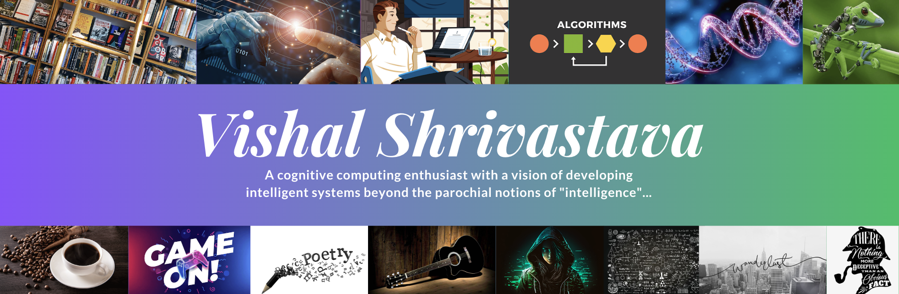
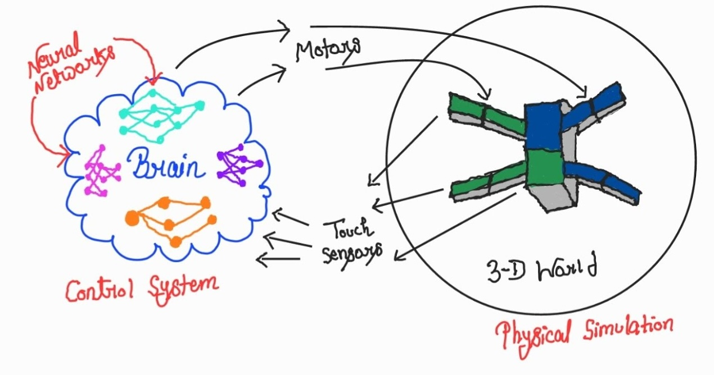
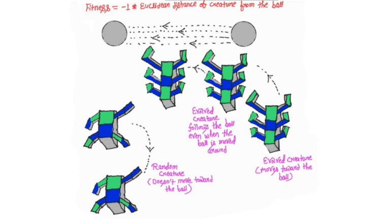

## Hi there! I'm Vishal 👋


<!--
🤝 Connect with me:

<a href="https://www.linkedin.com/in/shri-v/"></a>
<a href="https://www.instagram.com/v.the.wise/"></a>
<a href="https://medium.com/@shrivastava_vishal"></a>
<a href="https://www.youtube.com/channel/UCrQP9kdRmtVdF35Jfdct9nA"></a>
</br>
</br>
-->

- :man_student: Recent AI Master's graduate from Northwestern with a fervor for AI architecture and research.
- :man_technologist: Boasting over 3 years of hands-on experience crafting AI/ML-driven software solutions in healthcare and CRM sectors
- :telescope: Current research interest: Distributed knowledge representation and interactive learning with privacy preservation in stochastic multi-agent environments
- :speech_balloon: (Not so) guilty pleasure: Passionate discussions over freshly brewed coffee on topics ranging from the origin of life to the plots of Christopher Nolan's timeless masterpieces; and virtually everything in between

- ⚡ Key Interests
    ```
    * Artificial Life
    * Nature-Inspired Architectures & Algorithms
    * Machine and Deep Learning Theories
    * Natural Language Processing (NLP)
    * Data Structures & Algorithms
    * Multimodal Generative AI
    * Computational Complexity Theories
    * Cognitive Modeling & Decision Theories
    ```

### <b>Fun Stuff</b>

#### [Education in Evolutionary Robotics Random Evolution: B-Roll](https://youtu.be/JzwM6oWdAnE)
[](https://youtu.be/JzwM6oWdAnE)

#### [Education in Evolutionary Robotics Random Evolution - Final Project](https://youtu.be/cxVyn95cWYo)
[](https://youtu.be/cxVyn95cWYo)
